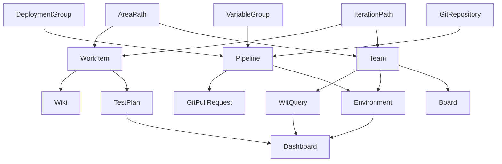

# Adapter dependency order and hierarchy

Some components in the ADO Backup Tool will depend on each other, thus it is crucial that you enable the correct set of components when **restoring** your project.

If you are only restoring a subset of components, please consult the graph in the next section to see what components you need to enable in your restore pipeline.

If you are restoring all components in a project at the same time, you can dismiss this document.

## Adapter hierarchy

## How to read the hierarchy graph

For the component you wish to restore, you must consult the graph and follow the arrows in reverse. You should enable the restoration of every component you encounter.

### Example scenario: Pipelines

For restoration of Pipelines, after consulting the above graph, we deduce that we must enable the restoration of the following components in the same pipeline:

- DeploymentGroup
- VariableGroup
- GitRepository

### Example scenario: Environments

For restoration of Environments, after consulting the above graph, we deduce that we must enable the restoration of the following components in the same pipeline:

- Pipeline
- DeploymentGroup
- VariableGroup
- GitRepository
- Team
- AreaPath
- IterationPath
